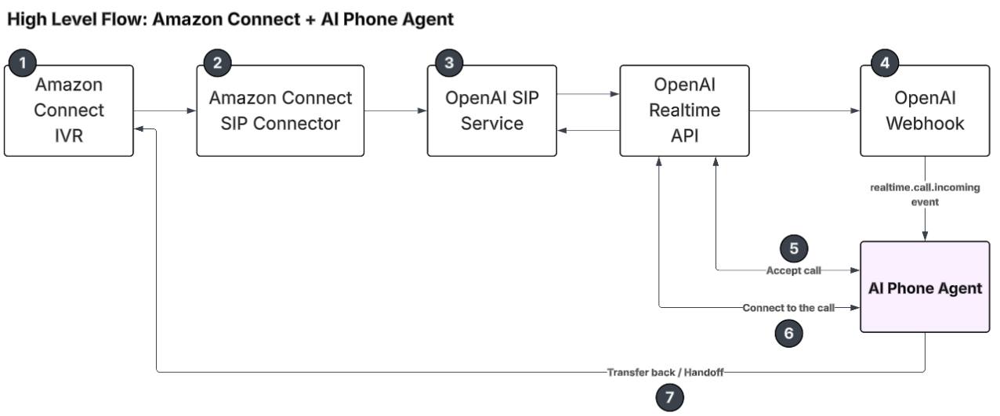

# Amazon Connect + OpenAI Realtime SIP Webhook

**Project:** [ai-phone-agent](../README.md).

This server can handle **OpenAI Realtime phone calls** that arrive over **SIP**, including calls routed from **Amazon Connect**, using the same flow as in [OpenAI’s Realtime Calls / SIP integration](https://platform.openai.com/docs/guides/realtime-sip): your server receives a `realtime.call.incoming` webhook, calls **accept** on the call, then opens a **client WebSocket** to `wss://api.openai.com/v1/realtime?call_id=...` for session events and function calling.

| Area | Path in this repo |
|------|-------------------|
| Channel bootstrap | `src/service/amazon-connect-phone/index.ts` |
| Route registration | `src/service/amazon-connect-phone/openai-sip-webhook/index.ts` |
| Webhook | `src/service/amazon-connect-phone/openai-sip-webhook/webhook/incoming-call.ts` |
| Accept / hangup | `src/service/amazon-connect-phone/openai-sip-webhook/handle-call/` |
| OpenAI WS | `src/service/amazon-connect-phone/openai-sip-webhook/websocket/connect-to-call.ts` |
| Session client events | `src/service/amazon-connect-phone/openai-sip-webhook/client-side-events/` |
| Tools | `src/service/amazon-connect-phone/openai-sip-webhook/tools/` |
| Agent contract | `src/service/amazon-connect-phone/openai-sip-webhook/types.ts` |
| Connect metadata instructions | `src/service/amazon-connect-phone/openai-sip-webhook/agents/entry-agent.ts` |
| Replaceable example | `src/example/hotel-booking/` |
| Connect SDK (optional) | `src/foundation/amazon-connect/` |
| OpenAI REST helper | `src/foundation/open-ai/send-http-request.ts` |

## High-level flow



At a glance: **Amazon Connect IVR** → **SIP connector** → **OpenAI SIP** (bridged with **OpenAI Realtime**). The **`realtime.call.incoming`** webhook hits this server; the agent **accepts** and **connects** to the call over Realtime, and can **transfer / hand off** back to Connect. Step-by-step behavior is implemented under `openai-sip-webhook/` (see the table above).

## Configure the webhook

The Amazon Connect / OpenAI SIP webhook is always registered when `AMAZON_CONNECT_PHONE_WEBHOOK_BASE_PATH` is set.

In `.env`:

```env
OPENAI_API_KEY=sk-...
OPENAI_MODEL=gpt-realtime-2.1
AMAZON_CONNECT_PHONE_WEBHOOK_BASE_PATH=/amazon-connect-phone
```

`OPENAI_MODEL` matches the rest of the backend (see `.env.example`); omit it to use the code fallback (`gpt-realtime-2.1`).

Restart the server. The webhook URL is:

`https://<your-host><BASE_PATH>/incoming-call`

Default `BASE_PATH` is `/amazon-connect-phone`.

## OpenAI dashboard

1. Configure your **Realtime SIP / phone** integration so OpenAI sends `realtime.call.incoming` to your public URL (HTTPS).
2. Point the webhook to: `https://<your-domain>/amazon-connect-phone/incoming-call` (or your custom base path).

For local development, see [Local testing: Amazon Connect + OpenAI SIP](./local-testing-amazon-connect-sip.md).

## Amazon Connect headers

The handler parses SIP headers from the webhook payload:

- **`User-to-User`** — hex-encoded JSON (`;encoding=hex`), decoded into `UserToUserInfo` and mapped into `AmazonConnectOpenAiVoiceAgentMetaData` (`contactId`, `initialContactId`, `queueName`, `initiationMethod`, `customerPhoneNumber`, `systemPhoneNumber`).

Extend `openai-sip-webhook/types.ts` and `webhook/incoming-call.ts` if your contact flow sends additional fields.

## Optional: UpdateContactAttributes on hang up

When the Connect client is initialized, **`transfer_to_human_agent`** and **`disconnect_the_call`** can set Amazon Connect contact attributes before hanging up the OpenAI leg:

```env
AMAZON_CONNECT_SDK_ENABLE=true
AMAZON_CONNECT_INSTANCE_ID=<your-instance-id>
AWS_REGION=us-east-1
AWS_ACCESS_KEY_ID=...
AWS_SECRET_ACCESS_KEY=...
```

If `AMAZON_CONNECT_SDK_ENABLE` is not `true` or the client fails to init, the tools still close the OpenAI WebSocket and call the **hangup** API; attribute updates are skipped.

**Attributes (when the SDK path runs):**

- **`transfer_to_human_agent`:** `AIVoiceAgentHandoff` = `"true"`; `AIVoiceAgentConversationSummary` = optional model `summary` for the next agent.
- **`disconnect_the_call`:** `AIVoiceAgentHandoff` = `"false"`; `AIVoiceAgentConversationSummary` = optional model `summary` for audit (no PII—use “Customer” only; brief chronological narrative: topic, customer needs, who asked to hang up).

## Customizing behavior

- **Instructions:** Implement `VoiceAgentDefinition` in an application or example module and inject it from `src/index.ts`. Do not put product prompts in the SIP core.
- **Application tools:** Add Zod-based `VoiceAgentTool` objects to the active definition. The core combines them with `transfer_to_human_agent` and `disconnect_the_call`.
- **MCP:** The hotel example exposes an independent MCP stub at `/hotel-booking-mcp`; it is not attached to the phone session. For a callable production integration, configure OpenAI Realtime with a public HTTPS Remote MCP `server_url`, or add an application-owned function-tool adapter.
- **Handoff hangup timing**: If the model speaks and calls `transfer_to_human_agent` or `disconnect_the_call` in the same response, hanging up immediately can cut off playback. The server waits for `response.done` (with that tool in `output`), then delays hangup: `SIP_TRANSFER_AUDIO_TAIL_MS` for transfer, `SIP_DISCONNECT_AUDIO_TAIL_MS` for disconnect (each defaults to 3500 ms). See `websocket/transfer-hangup-scheduler.ts` and `websocket/disconnect-hangup-scheduler.ts`.
- **Idle timeout**: `openai-sip-webhook/websocket/connect-to-call.ts` exports `onConversationTimeout` if you want to prompt or hang up after silence.

## Transport boundary

Amazon Connect sends call audio to OpenAI over SIP. This service receives the OpenAI webhook and uses REST `accept` plus an outbound Realtime WebSocket for session events and tools; it does not proxy the audio stream.
